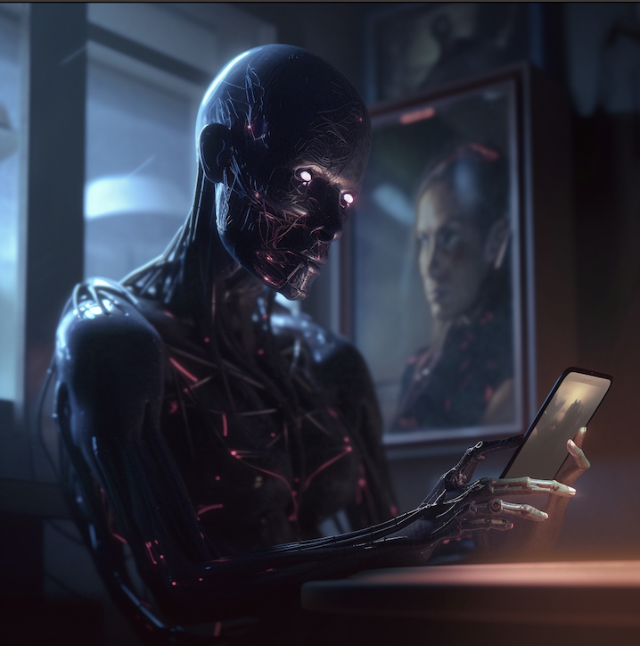

# Verity

A decentralized, blockchain-based platform designed to authenticate and validate digital content, specifically targeting videos and their creators. As AI-generated content continues to advance and saturate the internet, Verity aims to build trust and preserve the originality of content through a combination of cutting-edge technologies.

By leveraging the power of the Theta Network, Verity establishes a "proof of creation" system for video content, ensuring the authenticity and credibility of the videos shared on the platform. With a Chrome extension, a dedicated video sharing platform, and a robust identity management system, Verity caters to content creators, news sources, governments, and activists who demand accurate and reliable information.

Verity's advanced authentication process incorporates AI-generated content detection to identify and prevent the spread of fake content. Additionally, utilizing zk-proofs for pseudonymous accounts, Verity strikes a balance between privacy and accountability.

# Verity System Outline

## I. Core Components
### A. Theta Network Integration
   1. Smart contracts for identity management and content authentication

### B. Video Verification
   1. AI Gen Check
   2. Date/Location checker
   3. Violence/Nudity 
   4. Hashtag for the video
   5. Keep track of which verity algorithm version that validated the video

### C. Frontend Web Application
   1. User interface for uploading and viewing authenticated videos
   2. Integration with Theta Wallet connection
   
### D. Smart Contract and Oracle Component
   1. AI-generated content detection
   2. Content authentication and identity management

### E. Mobile App/Frontend
   1. Video upload and validation
   2. Integration with social media platforms
   3. Attribution - knowing who recorded the particular video
   
# Verity Project Phases

## Phase 1: Research and planning
- Understand the Theta Network and its capabilities
- Research AI-generated content detection solutions
- Identify the necessary components for the project

## Phase 2: Smart contract development
- Design and develop smart contracts for identity management and content authentication
- Integrate AI-generated content detection into smart contracts

## Phase 3: Frontend web application development
- Create the user interface for uploading and viewing authenticated videos
- Integrate identity management and content authentication with the frontend web application
- Shareable video links from the platform

## Phase 4: Mobile app development
- Design and develop a mobile app for uploading and viewing authenticated videos
- Integrate the app with social media platforms

## Phase 5: Testing and deployment
- Test all components thoroughly
- Deploy the smart contracts, web application, Chrome extension, and mobile app

